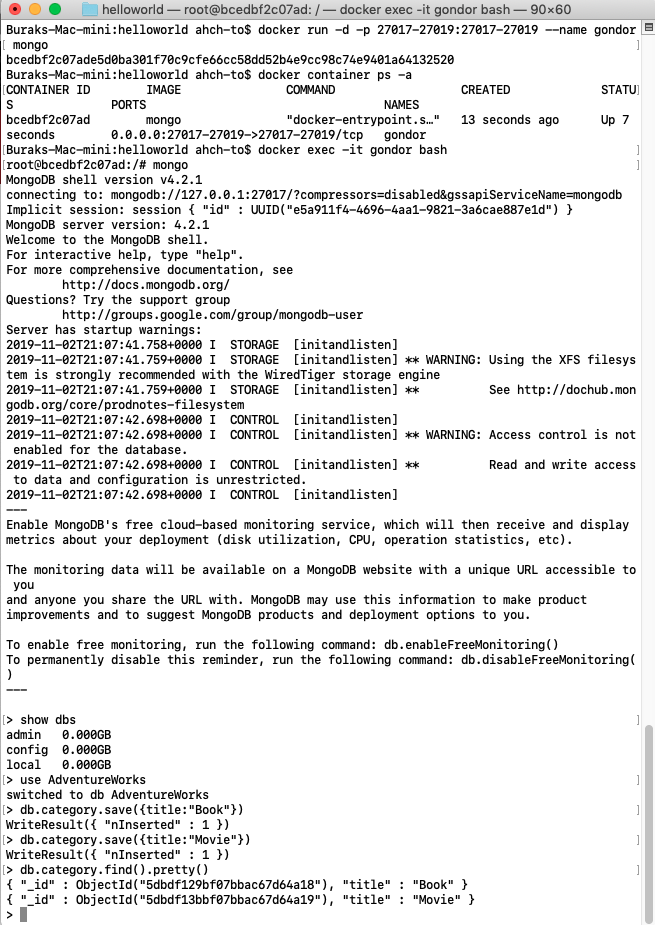
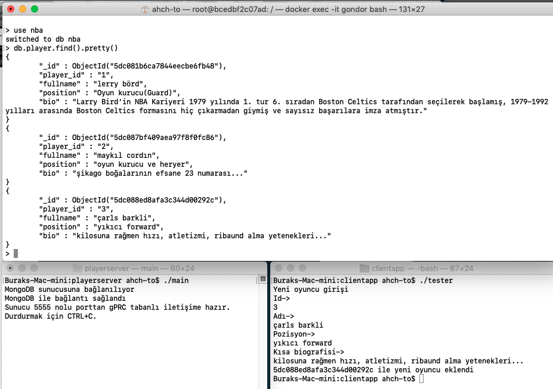
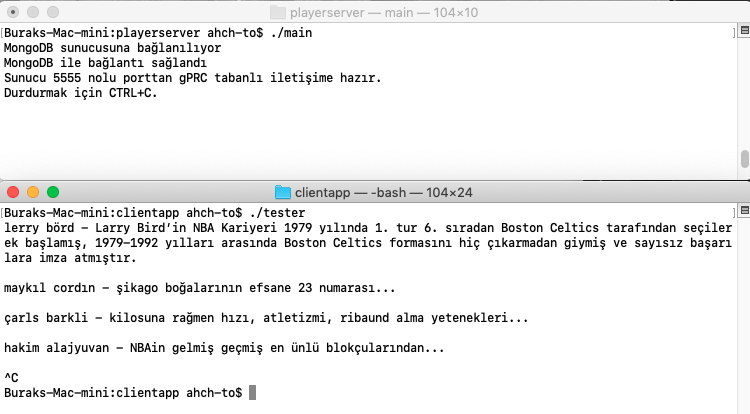
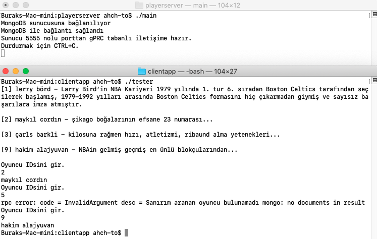
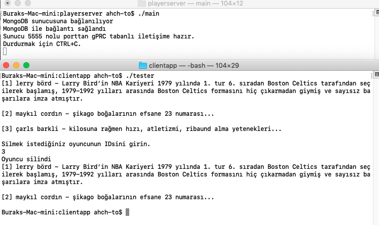

# MongoDB ile bir GO Uygulamasını Konuşturmak

Elimizdeki malzemeleri sayalım. MongoDB için bir docker imajı, gRPC ve GoLang. Bu üçünü kullanarak CRUD operasyonlarını icra eden basit bir uygulama geliştirmek niyetindeyim. Bir önceki öğretide Redis docker container'dan yararlanmıştım. Ahch-To sistemini kirletmemek adına MongoDB için de benzer şekilde hareket edeceğim. Açıkçası GoLang bilgim epey paslanmış durumda ve sistemde yüklü olup olmadığını dahi bilmiyorum.

```
go version
```

terminal komutu da bana yüklü olmadığını söylüyor. Dolayısıyla ilk adım onu MacOS'a kurmak.

## İlk Hazırlıklar (Go Kurulumu ve MongoDB)

GoLang'i Ahch-To adasına yüklemek için [şu adrese](https://golang.org/dl/) gidip Apple macOS sürümünü indirmem lazım. Ben öğretiyi hazırlarken go1.13.4.darwin-amd64.pkg dosyasını kullandım. Kurulum işlemini tamamladıktan sonra komut satırından go versiyonunu sorgulattım ve aşağıdaki çıktıyı elde ettim.


Pek tabii içim rahat değildi. Evet versiyon bilgisi gelmişti ama bir "hello world" uygulamasını da çalışır halde görmeliydim ki kurulumun sorunsuz olduğundan emin olayım. Hemen resmi dokümanı takip ederek $HOME\go\src\ altında helloworld isimli bir klasör açıp aşağıdaki kod parçasını içeren helloworld.go dosyasını oluşturdum _(Visual Studio Code kullandığım için editörün önerdiği go ile ilgili extension'ları yüklemeyi de ihmal etmedim)_

```
package main

import "fmt"

func main() {
	fmt.Printf("Artık go çalışmaya hazırım :) \n")
}
```

Terminalden aşağıdaki komutları işlettikten sonra çıktıyı görebildim. 

```
go build
./helloworld
```


Go ile kod yazabildiğime göre MongoDB docker imajını indirip bir deneme turuna çıkabilirim. İşte terminal komutları.

```
docker pull mongo
docker run -d -p 27017-27019:27017-27019 --name gondor mongo
docker container ps -a
docker exec -it gondor bash

mongo
show dbs
use AdventureWorks
db.category.save({title:"Book"})
db.category.save({title:"Movie"})
db.category.find().pretty()

exit
exit
```



İlk komutla mongo imajı çekiliyor. İzleyen komut docker container'ını varsayılan portları ile sistemin kullanımına açmak için. Container listesinde göründüğüne göre sorun yok. MongoDB veritabanını container üzerinden test etmek amacıyla içerisine girmek lazım. 4ncü komutu bu işe yarıyor. Ardından mongo shell'e geçip bir kaç işlem gerçekleştirilebilir.

Önce var olan veritabanlarını listeliyor sonra AdventureWorks isimli yeni bir tane oluşturuluyor. Ardından category isimli bir koleksiyona iki doküman ekleniyor ve tümünü güzel bir formatta listeliyoruz. Arka arkaya gelen iki exit komutunu fark etmişsinizdir. İlki mongo shell'den, ikincisi de container içinden çıkmak için.

Ah çok önemli bir detayı unuttum. Örnekte gRPC protokolünü kullanacağız. Bu da bir proto dosyamız olacağı ve Golang için gerekli stub dosyasına derleme yapacağımız anlamına geliyor. Dolayısıyla sistemde protobuf ve go için gerekli derleyici eklentisine ihtiyacım var. brew ile bunları sisteme yüklemek oldukça kolay.

```
brew install protobuf
protoc --version
brew install protoc-gen-go
```

Kod tarafına geçmeye hazırız ama öncesinde ufak bir bilgi.

## gRPC Hakkında Azıcık Bilgi

gRPC, HTTP2 bazlı modern bir iletişim protokolü ve JSON yerine ProtoBuffers olarak isimlendirilen kuvvetle türlendirilmiş bir ikili veri formatını kullanmakta _(strongly-typed binary data format)_ JSON özellikle REST tabanlı servislerde popüler bir format olmasına rağmen serileştirme sırasında CPU'yu yoran bir performans sergiliyor. HTTP/2 özelliklerini iyi kullanana gRPC ise 5 ile 25 kata kadar daha hızlı. Bu noktada hatırlamak için bile olsa gRPC ile REST'i kıyaslamakta yarar var. İşte karşılaştırma tablosu.

| REST Tarafı                                         |                                                    gRPC Tarafı |
|-----------------------------------------------------|---------------------------------------------------------------:|
| HTTP 1.1 nedeniyle gecikme yüksek                   | HTTP/2 sebebiyle daha düşük gecikme                            |
| Sadece Request/Response                             | Stream desteği                                                 |
| CRUD odaklı servisler için                          | API odaklı                                                     |
| HTTP Get,Post,Put,Delete  gibi fiil tabanlı         | RPC tabanlı, sunucu üzerinden  fonksiyon çağırabilme özelliği  |
| Sadece Client->Server yönlü talepler                | Çift yönlü ve asenkron iletişim                                |
| JSON kullanıyor (serileşme yavaş, daha büyük boyut) | Protobuffer kullanıyor (daha küçük boyutta ve serileşme hızlı) |

## Kod Tarafında Yapılanlar

Uygulamanın temel klasör yapısını aşağıdaki gibi oluşturabiliriz. Ben bu işlemleri $HOME\go\src\ altında yaptım.

```
mkdir gRPC-sample
cd gRPC-sample
mkdir playerserver
mkdir clientapp
mkdir proto
```

playerserver ve clientapp tahmin edileceği üzere sunucu ve istemci uygulama görevini üstleniyorlar. proto klasöründe yer alan player.proto, gRPC mesaj sözleşmesine ait tanımlamaları içermekte. Servis metodları, parametre tipleri ve içerikleri bu dosyada bildiriliyor. Bu içeriğin Go kodlarında kullanılabilmesi için derlenmesi gerekiyor. Derlemeyi aşağıdaki terminal komutu ile gerçekleştirebiliriz. _(proto dosyasını VS Code tarafında daha kolay düzenlemek için vscode-proto3 isimli extension'ı kullandım)_

```
protoc player.proto --go_out=plugins=grpc:.
```

Proto dosyasının tamamlanmasını takiben playerserver klasöründe main.go dosyası üretildi. Biraz uzun bir kod dosyası oldu ama sabırla yazmakta ve yorum satırlarını da okuyarak neler yaptığımızı anlamaya çalışmakta yarar var.

Sunucu tarafındaki kodlama tamamlandıktan sonra istemci tarafı için clientapp altında tester.go isimli bir başka dosya oluşturuldu. Burada komut satırından temel CRUD operasyonlarını icra edeceğiz. Yeni bir oyuncunun eklenmesi, bir oyuncunun bilgisinin çekilmesi, tüm oyuncuların listesinin alınması vb

## Çalışma Zamanı

İlk gün çalışmasının meyveleri pek fena değil. server ve client tarafa ait go dosyalarını kendi klasörlerinde aşağıdaki terminal komutları ile derledikten sonra

```
go build main.go
go build tester.go
```

önce sunucu ardından istemci tarafını çalıştırıp servis tarafındaki kodlaması ilk biten AddPlayer fonksiyonunu deneme şansı buldum. Birkaç oyuncu verisini girdikten sonra mongodb container'ına ait shell'e bağlanıp gerçekten de yeni dokümanların player koleksiyonuna eklenip eklenmediğine baktım. Sonuç tebessüm ettiriciydi :) İstemci uygulama gRPC üzerinden sunucuya mesaj göndermiş, sunucuya gelen içerik docker container üzerinde duran mongodb veritabanına yazılmıştı.



İkinci gün tüm oyuncu listesini gRPC üzerinden istemciye döndüren süreci yazmaya çalıştım. İlk başta yaptığım bir hata nedeniyle epey vakit kaybettim. GetPlayerList metodunu protobuffer dosyasında stream döndürecek şekilde tasarlamamıştım. Büyük bir oyuncu listesini filtresiz olarak çekmek istediğimizde bu sorun olabilir. Oyuncuları sunucudan istemciye doğru bir stream üzerinden tek tek göndermek daha mantıklı. Sonunda servis sözleşmesini değiştirip gerekli düzenlemeleri yaptıktan sonra aşağıdaki ekran görüntüsünde yer alan mutlu sona ulaşmayı başardım.



Devam eden gün biraz zorlu geçti. FindOne metodunu player_id değerine göre bir türlü çalıştırmayı başaramadım. Neredeyse 4 pomodoro periyodu uğraştım. Sonunda sorunu anladım. İstemci aradığı ID değerini girip sunucuya çağrı yaptığında, servis metoduna gelen ID bilgisinin sonunda boşluk ve altsatıra geçme karakterleri de geliyormuş. Trim yaparak sonucu halledebildim ve örnek olarak aşağıdaki sonuçları elde ettim.



Silme operasyonuna ilişkin çalışmaya ait örnek bir ekran görüntüsü de aşağıdaki gibi.



## Neler Öğrendim?

- Bir protobuf dosyası nasıl hazırlanır ve Go tarafında kullanılabilmesi için nasıl derlenir
- Go tarafından MongoDB ile nasıl haberleşilir
- MongoDB docker container'ına ait shell üstünde nasıl çalışır
- Temel mongodb komutları
- Sunucudan istemciye stream açarak tek tek mongo db dokümanını nasıl döndürebileceğimi _(main.go'daki GetPlayerList metoduna bakın)_
- Sunucu tarafındaki Get metodlarında gelen verinin sağında kalan boşluklar nedeniyle sorguların doğru çalışmadığını _(4 pomodoro turuma maloldu)_

## Eksikliği Hissedilen Konular

- İstemci tarafını Go tabanlı bir web client olarak geliştirmeyi deneyebiliriz. Terminalden hallice daha iyidir.
- Bir çok sunucu metodunda hata kontrolü var ancak bunların çalışıp çalışmadığı test edilmedi.

## Görev Listeniz

- Select * from players where fullname like 'A%' gibi bir sorguya karşılık gelecek mongodb fonksiyonunu geliştirin
- Güncelleme fonksiyonunu tamamlayın