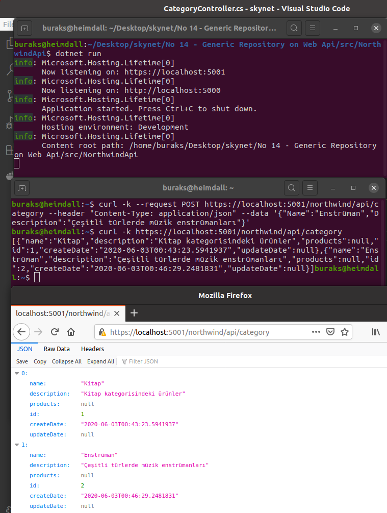

# Bir Asp.Net Core Web Api Projesinde Generic Repository Deseninin Kullanımı

Eski pratikleri de hatırlamak istiyorum. Çok eskiden .Net Framework tarafında deneyimlediğim generic repository tasarım kalıbını birde .Net Core 3.1 tarafında uygulamak iyi olacak. Senaryo basit. Kobay türlerimiz kategori ve ürün listeleri. Tahmin edileceği üzere bir kategoride n adet ürün olabilir. Northwind ismi de oldukça tanıdık değil mi? Uygulama sırasında Interface'lerin nasıl tasarlandığına, .Net Core'un dahili dependency injection mekanizması ile Controller'lara bağımlılıkların nasıl aktarıldığına da odaklanmak önemli.

## Hazırlıklar

Proje iskeletinin ve ek klasörlerin oluşturulması.

```bash
dotnet new webapi -o NorthwindApi
cd NorthwindApi

dotnet add package Microsoft.EntityFrameworkCore.Sqlite

mkdir Models
touch Models/IEntity.cs
touch Models/Entity.cs
touch Models/Category.cs
touch Models/Product.cs
mkdir Repositories
touch Repositories/IRepository.cs
touch Repositories/Repository.cs
touch Repositories/IProductRepository.cs
touch Repositories/ProductRepository.cs
mkdir Context
touch Context/NorthwindContext.cs
touch Controllers/CategoryController.cs
touch Controllers/ProductController.cs
```

## Çalışma Zamanı

```bash
dotnet run
```

>Antrenman bitince kompozisyona dahil olan container'ları kaldırmak için _sudo docker-compose down_ komutu kullanılabilir.

