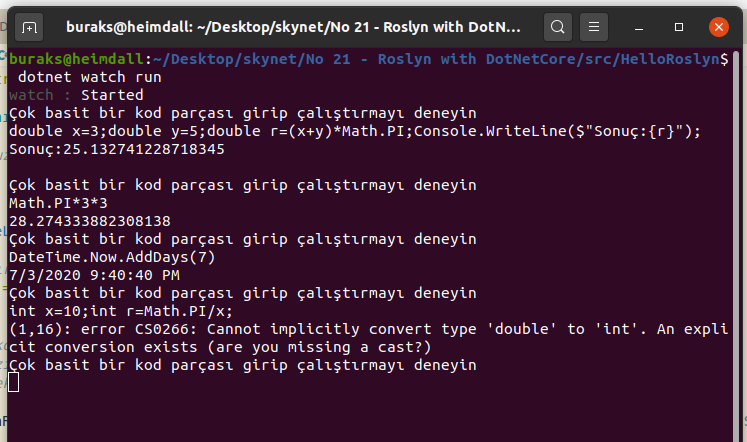
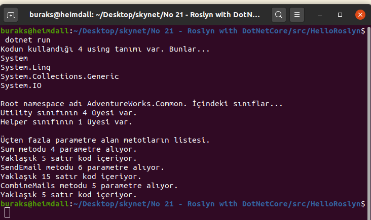

# .Net Core Üzerinde Roslyn Pratikleri Yapmak

Amacım uzun süredir _(Tanıtıldığı Ekim 2011 yılından bu yana)_ hayatımızda olan .Net Compiler Platform'unu _(Kod adı Roslyn)_ pratik kod parçaları ile tanımak. Roslyn ile çalışma zamanında kod çalıştırmak, statik kod analizi yapmak mümkün. Özellikle kod satır sayısı çok yüksek olan uygulamalarda clean code pratiklerinin işletilmesi gibi durumlarda epey kullanışlı. Text tabanlı kodun çalışma zamanına yüklemeden ağaç yapısının _(syntax tree)_ çıkartılması ve içeriğinin analiz edilmesi çok kolay. Yani üzerinde çalıştığımız .Net projelerinin içeriklerini onları çalıştırmaya gerek kalmadan pek güzelce analiz edebiliyoruz.

Roslyn, C#'ı script dili olarak kullandırma noktasında da avantajlar sunuyor. Şöyle düşünelim; C# bilgimiz var ve .Net Framework kütüphanesine hakimiz. Bazı otomatize sistem işleri için Powershell veya Bash script öğrenmek yerine C#'ı script dili olarak kullanabilmemiz mümkün. .Net Core desteği olması da bunu Cross Platform yapabilmemize izin veriyor. Çalışmadaki amaçlarımdan birisi de dotnet-script komut satırı aracını kullanarak içerisinde C# script kodları içeren csx uzantılı kodları çalıştırmak. Bu CSX uzantılı _(CSharp Script dosyası anlamına geliyor)_ dosyalar Powershell veya bash için yazılmış script dosyaları gibi düşünülebilir.

## Birinci Önrek için Ön Hazırlıklar ve Çalıştırma

Heimdall _(Ubuntu 20.04)_ üzerindeki pratikler için uygulamaya Microsoft.CodeAnalysis.CSharp.Scripting paketinin eklenmesi lazım.

```bash
dotnet new console -o HelloRoslyn
dotnet add package Microsoft.CodeAnalysis.CSharp.Scripting

dotnet watch run
```
>Kodun çalışması ile ilgili bilgiler yorum satırlarında mevcut ;)

Region1 çalışmasına ait örnek ekran görüntüsü,



Region2 çalışmasına ait örnek ekran görüntüsü,


Region3 çalışmasına ait örnek ekran görüntüsü,


Region3 Syntax Tree Mevzusu



## İkinci Örnek için Ön Hazırlıklar ve Çalıştırma

İlk örneklerde C# kodlarının dinamik olarak yine bir C# uygulaması içerisinden çalıştırılması ve temel seviyede statik kod analizi işlemleri söz konusu. Bu sefer Nuget paket desteği de sunan dotnet-script ile script dosyalarının nasıl yürütülebileceği inceleniyor.

```bash
# Önce gerekli komus satırı aracı yüklenir
dotnet tool install -g dotnet-script

# Yüklü olan dotnet tool setine aşağıdaki komutla bakılabilir
dotnet tool list -g

# Örnek script dosyası
touch dirwatcher.csx

# Çalıştırmak içinse
dotnet script dirwatcher.csx
```


## Bölümün Bomba Soruları

- Console uygulamasının kodunun ikinci region bloğunda yer alan kod çalışma zamanında hangi durumlarda exception vererek sonlanır _(Kısaca Patlar)_
- CSX örneği ilk çalıştırıldığında cevap vermesi neden çok uzun sürmüştür.
- CSX örneğindeki Nuget paketi sizce nereye inmiştir?

## Ödevler

- Bir web sayfasında Multiline TextBox kontrolüm olsun. İçine yazdığım basit C# kodlarının sonucunu anında başka bir kutucukta görebileyim. Web'deki pencerede C# script'leri yazdığımızı düşünelim.
- dotnet-script init komutunu deneyip ne işe yaradığını anlamaya çalışın.
- Program.cs'teki Syntax Tree Mevzusu kısmından yararlanarak kendi kodlarınızda if bloklarının kullanıldığı metotları bulmaya çalışın. _(Buradan Cognitive Complexity problemlerini bulmaya giden yolun kapısını açabiliriz)_