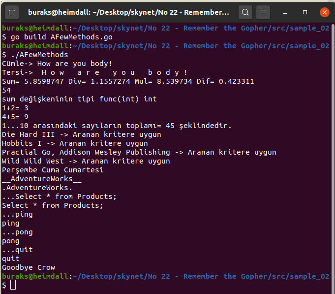
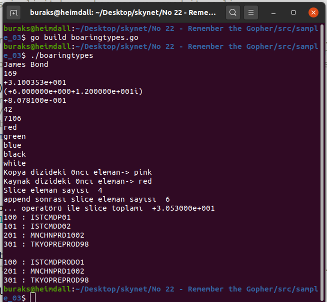
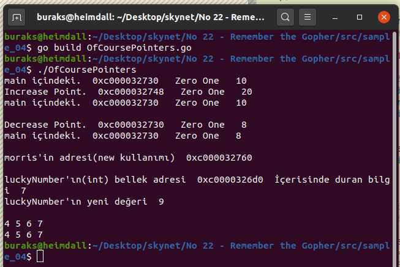
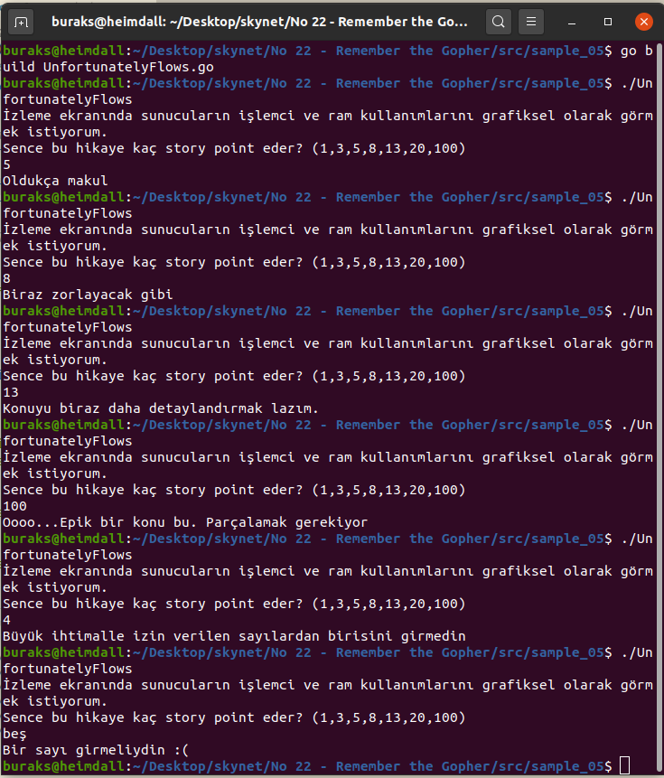
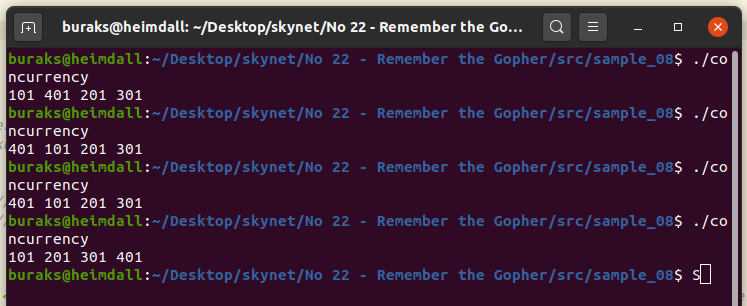
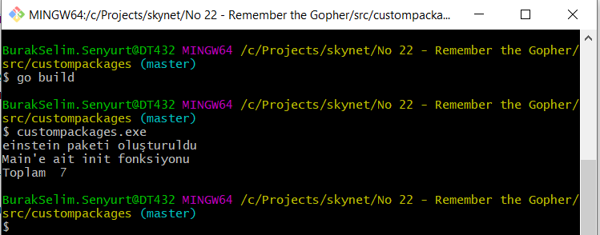
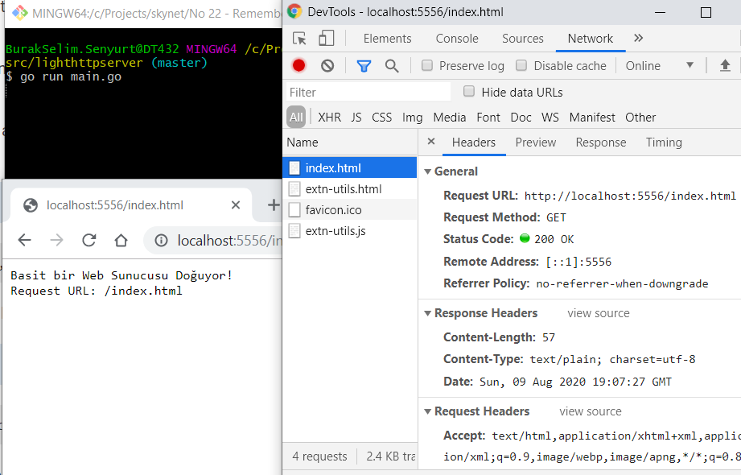
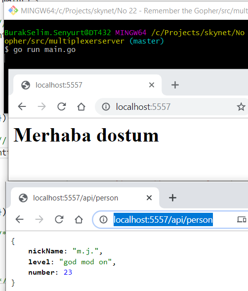

# Go Dilinin Temellerini Hatırlamak

Bu çalışmadaki amacım epey süre ara verdiğim go dilinin temellerini hatırlamak.

## Ön Hazırlıklar

Örneklere başlarken Heimdall _(Ubuntu 20.04)_ üstünde go dili için gerekli ortamın hazır olmadığını fark ettim. Dolayısıyla bir kurulum yapmam gerekti. İlk olarak [şu](https://golang.org/dl/) adresten uygun sürümü indiri usr/local altına açtım.

```bash
#Downloads klasörüne inen dosyayı talimatlara uyarak /usr/local altına açtım
sudo tar -C /usr/local -xzf go1.14.4.linux-amd64.tar.gz 
```

Sonrasında /etc klasörü altındaki profile dosyasının sonuna aşağıdaki yol tanımını ekledim. 

```text
export PATH=$PATH:/usr/local/go/bin
```

Sisteme tekrak giriş yaptıktan sonra yüklenmiş go sürümüne baktım.


Her şey yolundaydı ve kodlamaya geçebilirdim.

## Çalışma Zamanı

Örnekler birden fazla dosyadan oluşuyor. Sırasıyla örneklerin build ve çalışma zamanı görüntüleri aşağıdaki gibidir.

### Go'ya Merhaba Dediğimiz Örnek _(intro klasörü)_

```bash
#Build işlemi
go build IHateHelloWorld.go
# ve dosya adını kullanarak programı çalıştırma
./IHateHelloWorld
```


### Birkaç Fonksiyon Kullanımının Ele Alındığı Örnek _(functions)_
```bash
go build AFewMethods.go
./AFewMethods
```



### Temel Veri Türlerinin Ele Alındığı Örnek _(datatypes)_

```bash
go build boaringtypes.go
./boaringtypes
```



### Pointer Türünün Ele Alındığı Örnek _(pointertype)_

```bash
go build OfCoursePointers.go
./OfCoursePointers
```



### Temel Flow Control İfadelerine Ait Örnek Çıktıları _(flowcontrols)_

```bash
go build UnfortunatelyFlows.go
./UnfortunatelyFlows.go
```




### Basit Interface tipi Kullanımının Örnek Çıktısı _(interfacetype)_

```bash
go build UsingInterface.go
./UsingInterface.go
```


### Kendi error nesnemizin kullanımına ait örnek Çıktı _(customerrors)_

```bash
go build errorHandling.go
./errorHandling.go
```


### Concurrency kullanımına ait örnek çıktı _(concurrentworks)_

```bash
go build concurrency.go
./concurrency.go
```



### Kendi modülümüzü kullandığımız örneğe ait çıktı _(custompackages)_

```bash
# modüller için gerekli başlangıç işlemi (go.mod oluşur)
go mod init custompackages

touch main.go

# custompackages isimli modül içerisinde kullanacağımız örnek paketin hazırlanması
mkdir einstein
touch einstein/einstein.go

# örneği windows ortamında hazırladığım için exe oluştu
go build
custompackages.exe
```



### İlkel Web Server koduna ait çıktı _(lighthttpserver)_

```bash
go run main.go
```



### Multiplexer yapısını kullanan web server örneğine ait çıktı _(multiplexerserver)_

```bash
go run main.go
```



## Bölümün Bomba Soruları

- Bir tamsayı değişkeninin bellek adresinden yararlanarak bir sonraki bellek adresindeki içeriği öğrenebilir miyim?
- İsimsiz bir fonksiyonu bir ifade içerisinde tanımlayıp kullanabildiğimizi gördük _(Bknz: AFewMethods.go)_ Sizce bu nerelerde işimize yarar?
- Bir fonksiyonu değişkene atayabildiğimizi de gördük. Peki ya bu hangi hallerde işimize yarar?
- Ya bir fonksiyonu başka bir fonksiyona parametre olarak geçebiliyor olmamıza hatta fonksiyondan fonksiyon dönebiliyor olmamıza ne demeli... _(Higher Order Functions)_ Bu kullanım şekli nerelerde işimize yarar?

## Ödevler

- Kullanıcının terminalden gireceği komutlara göre şu senaryoyu işleyecek kodu yazın._Kullanıcı "types" yazdığında go'da kullanılan temel tipler ekrana yazdırılsın. "rand" yazdığında ekrana rastgele bir sayı yazsın."today" yazdığından günün tarihini ve hangi günde olduğumuzu yazsın. "alan dikdortgen 4 5" yazdığında dikdortgenin alanını hesaplayıp yazsın ve hatta 5X4 lük + işaretlerinden oluşan dikdörtgeni terminale çizsin. "quit" dediğinde programdan çıksın_
- AFewMethods.go boringtypes.go örneklerinden kullanılan sumofall fonksiyonunu ortak bir go paketinden kullandırınız.
- ... operatörünün kullanıldığı 4 yeri _(3 değil)_ örnekleyiniz.
- Bir struct listesindeki elemanlarda bizim yolladığımız fonksiyonu parametre olarak alıp çalıştıracak bir başka fonksiyon yazınız.
- En az iki paket içerip onları kullanan örnek bir Go modülü geliştiriniz

>To Be Continued