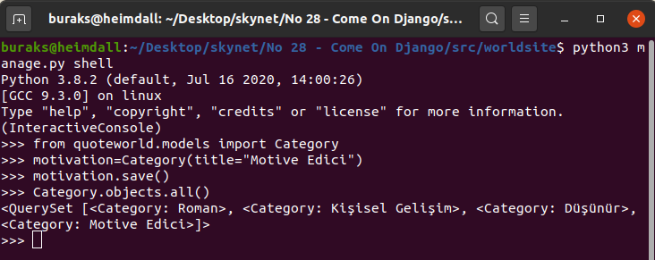
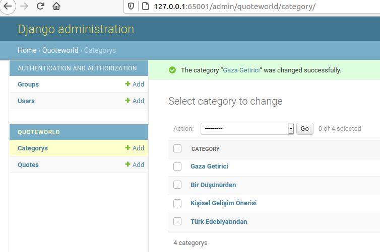

# Django ile Bir Web Uygulaması Geliştirmek

Bir zamanlar IoT cihazlarda uygulama geliştirmek için Python programlama dilini öğrenmeye çalışmıştım. O vakitler Flask ile basit REST Servisleri deneyimleme fırsatım da olmuştu ama Django ile etraflıca uğraşmamış bir web sitesi/uygulaması geliştirmeyi denememiştim. İşte rövanş zamanı. Amacım Django'nun resmi dokümanlarını takip ederek basit bir web uygulaması geliştirme deneyimini yaşamak. Örneği favori dostum Heimdall _(Ubuntu 20.04)_ ile birlikte geliştireceğim.

## Yapılanlar

Elbette sistemde python ve pek tabii django çatısının yüklü olması gerekiyor.

```bash
# Sistemde python yüklü olduğundan aşağıdaki komut ile django framework'ü yükledim
python -m pip install Django

# Kurulumdan emin olmak için versiyon kontrolü yaptım
python -m django --version

# Örneğin src klasörüne geçip aşağıdaki komutu kullanarak web site'ı oluşturdum(Project olarak düşünelim)
# Standart olarak bir web site şablonu oluşur. Bu aslında proje klasörüdür. Web Site gibi düşünürsek içinde birden fazla web application içerebilir
django-admin startproject worldsite

# manage.py dosyası özellikle django işleri için kullanacağımız komut satırı programıdır
# ki örneği bu haliyle belli bir porttan çalıştırmak için onu aşağıdaki gibi kullanmak yeterlidir.
# Port bilgisi girilmezse 8000 portu kullanılır.
# Aşağıdaki işlem sonrası komut satırında migration tarafının tamamlanmadığı(model oluşturduktan sonra migrate yaparız) uyarısı ile birlikte http://localhost:65001 adresinde uzaya doğru hareket eden bir roket figürü görülmelidir ;)
cd worldsite
python manage.py runserver 65001

# Şimdi bu site altında bir web uygulaması oluşturalım. Yukarıda belirtmiştim. Site birden fazla web uygulaması içerebilir ve herbirinin konfigurasyon yönetimi buradan yapılabilir
python manage.py startapp quoteworld

# quoteworld içerisinde örnek bir view oluşturulur.
cd quoteworld
touch views.py

# Ayrıca url map tanımları için birde urls.py dosyası eklenir.
touch urls.py

# Örnekte kullanılacak veri modelleri için models.py isimli bir modül oluşturuyoruz.
touch models.py

# Model sınıfları da oluşturulduktan sonra migration işlemi yapılabilir
# Migration işleminin quoteworld uygulaması için de çalışması için settings.py'de bildirim yapılmıştır.
# Migration tamamlandıktan sonra oluşan 0001_initial.py dosyasına bakmayı ve BigKahunaClub.sqlite3 veri tabanını incelmeyi unutmayın.
cd ..
python manage.py makemigrations quoteworld
python manage.py migrate

# Migrate işlemi başarılı olduysa terminali kullanarak veri üzerinde işlemler yapabiliriz de
# shell'i açmak için aşağıdaki komut kullanılır
# Örnek çalışma için aşağıdaki ekran görüntüsüne bakabiliriz
python manage.py shell
```



Kaldığımız yerden devam edelim.

```bash

```

## Çalışma Zamanı

quoteworld web uygulaması sunucu çalıştırma şeklimiz gereği http://localhost:65001/quoteworld adresi üzerinden hizmet verecektir. 

```bash
# manage.py ile aynı yerdeyken
python manage.py runserver 65001
```



## Bomba Sorular

- Varsayılan olarak gelen Sqlite desteğine istinaden db.sqlite3 isimli bir dosya veriliyor. Lakin benim örneğimde bu veritabanının adı BigKahunaClub.sqlite3. Sizce migrate işleminin bu veritabanını kullanacağını nerede belirtmiş olabilirim?

## Ödevler

- 