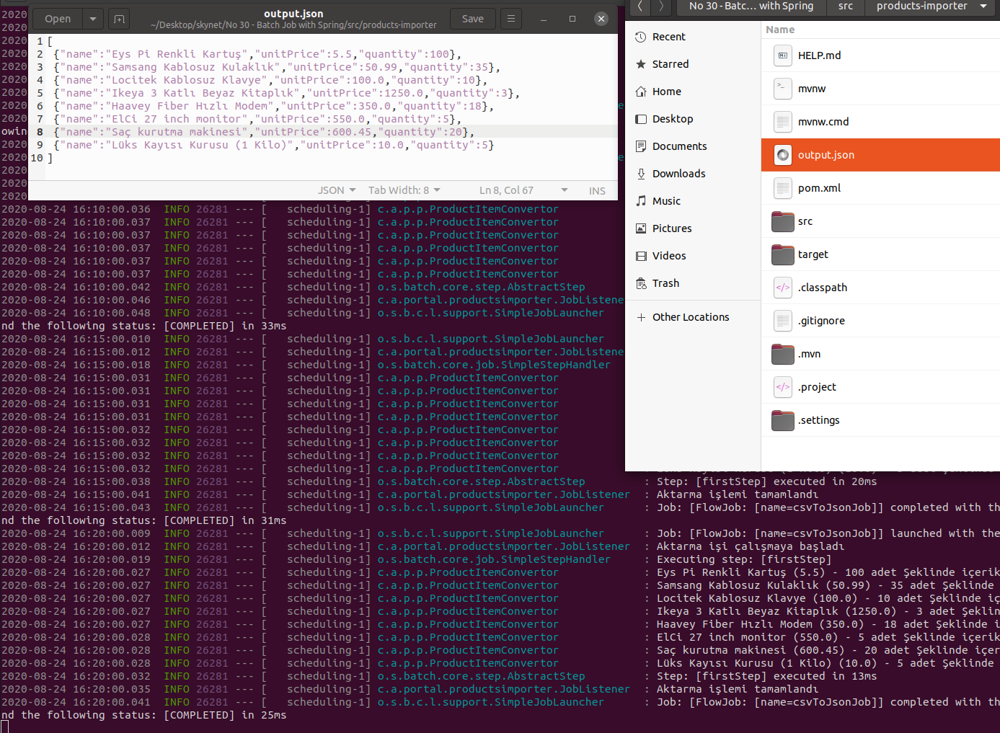

# CSV İçeriğini Veritabanına Alan Bir İşi Spring ile Geliştirmek

Text tabanlı dosyalardan farklı ortamlara veri transferleri halen daha popüler. Bir zamanlar bunun için SQL Server Integration Services(SSIS) paketleri ile epey haşırneşir olmuştum. En sık uyguladığımız yöntemlerin başında belli sistemlerin ürettiği CSV içeriklerinin çeşitli kurallardan geçerek veritabanına aktarılmasıydı. Benim merak ettiğim bu tip bir yığın veri işini Spring ile nasıl kolaylaştırdıkları. Sanırım 27 numaralı örneğin etkisinde kaldım :) Spring'ten faydalanıp Java ile bir şeyler yapmak hoşuma gitti. Bu çalışmadaki amacım ise en az iki adet CSV içeriğini alıp arka arkaya birleştirmek ve çıktısını tek bir JSON dosyasında sunmak. Temel prensipleri ve iş akışının temellerini anlamak niyetindeyim. Hatta işi planlı hale getirmek ve örneğin söz konusu akışın 5 dakikada bir çalıştırılmasını da sağlamak istiyorum.

## Hazırlıklar

Heimdal _(Ubuntu 20.04)_ üstünde JDK, Maven gibi aparatlarım zaten yüklü. Kod editörü olarak da Visual Studio Code'u kullanıyorum. Spring projesinin ilk açılışı için elbette [şu](https://start.spring.io/) adrese uğramak gerekiyor. Batch işlemleri için Spring Batch paketini kullanmak gerektiğinde bunu bir Dependency olarak eklemeliyiz. _(CSV dosya örnekleri src/main/resources altında yer alıyor. Basit olması açısından ürün adı, birim fiyatı ve gönderilen adet bilgilerinin tutulduğu bir içerik söz konusu)_


Gelelim eklediklerimize.

```bash
cd products-importer

# CSV üzerindeki bir satırı temsil edecek bir POJO sınıfı tasarlıyoruz
touch src/main/java/com/azon/portal/productsimporter/Product.java

# CSV'yi okuduğumuz sırada satır bazında işlem yapmak istersek araya girebiliriz.
# Aşağıdaki dosya bunu anlamam için var.
touch src/main/java/com/azon/portal/productsimporter/ProductItemConvertor.java

# POJO hazır. Transform sırasında devreye giren sınıf kodu da...
# Şimdi Batch akışının tasarlandığı kodlarımıza geçelim.
touch src/main/java/com/azon/portal/productsimporter/BatchConfiguration.java

# Aşağıdaki sınıfı ise batch'in çalışması sırasındaki olayları takip etmek için kullanabiliriz.
touch src/main/java/com/azon/portal/productsimporter/JobListener.java
```

## Çalışma Zamanı

Uygulamayı Maven veya Gradle üzerinden çalıştırmamız mümkün. Ben maven'ı tercih ettim.

```bash
# Uygulamayı maven aracı ile doğrudan çalıştırmak istersek aşağıdaki terminal komutunu kullanabiliriz.
./mvnw spring-boot:run

# Build edip Java ile çalıştırmak istersek de şöyle yapmamız yeterli.
./mvnw clean package
java -jar target/products-importer-0.0.1-SNAPSHOT.jar
```

_Dikkat edileceği üzere output.json içeriği csv dosyalarından birleştirilmiştir ve söz konusu iş beş dakikada bir tekrar çalışmaktadır_



## Bomba Sorular

- Bir Batch işi içerisinde birden fazla adım _(step)_ olabilir mi?

## Ödevler

- CSV dosyalarını birleştirip yine JSON formatında ama bu kez MongoDB'ye kaydetme işlemlerini gerçekleştirebilir misiniz?