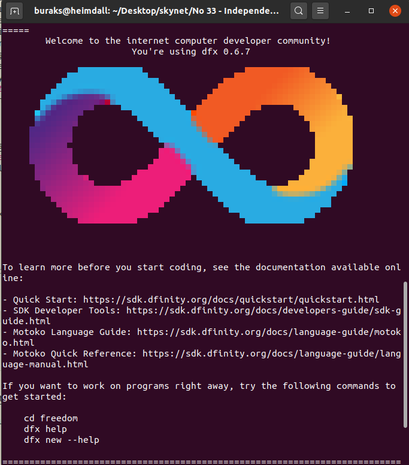
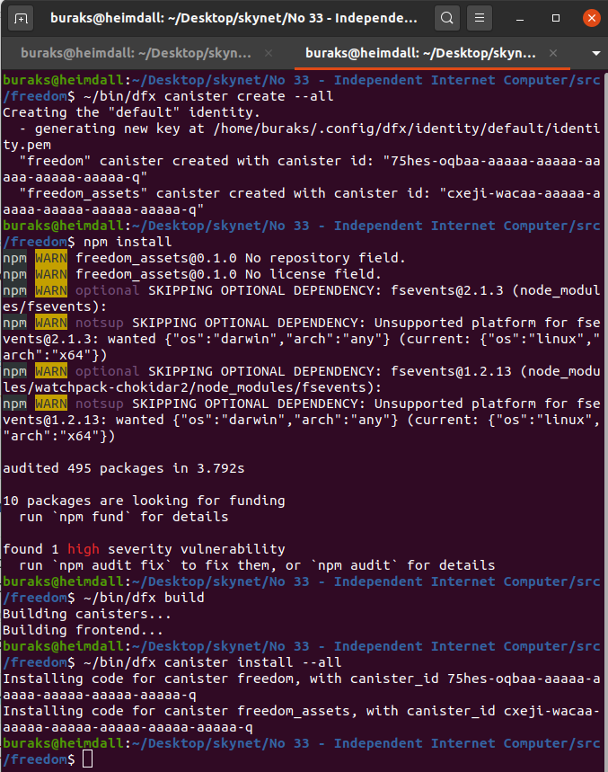
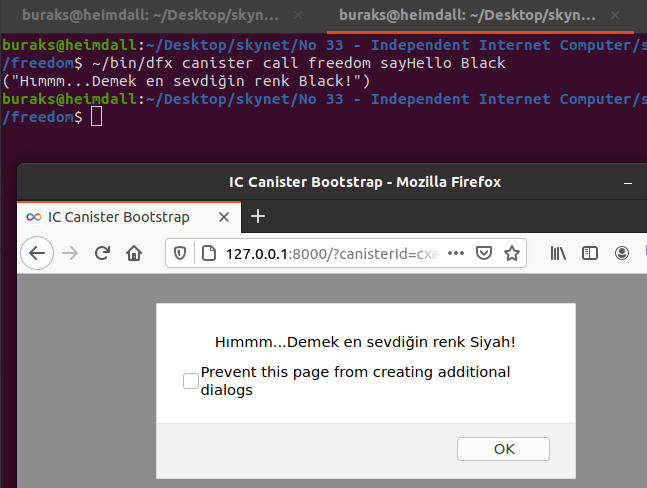

# The Internet Computer _(Internetin Yeniden Keşfi)_ ve Motoko'yu Duyunca Ben

Herkese açık olan interneti genişletip kendi yazılım sistemlerimizi, kurumsal IT çözümlerimizi, web sitelerimizi, dağıtık bir ortamda firewall'lara, yedekleme sistemlerine ihtiyaç duymadan güvenli bir şekilde konuşlandırabildiğimizi düşünelim. Hatta bunu sağlayan altyapı ile internete konan bu sistemler arasında fonksiyon çağrıları yapar gibi kolayca haberleşebildiğimizi _(ve tabii ki güvenli bir ortamda)_ düşünelim. Biraz blockchain benzeri bir dağıtık sistem kurugus gibi değil mi? Tam olarak o olmasa da oradaki teorileri baz almışlar gibi görünüyor. _The Internet Computer_ adlı bu proje ICP _(Internet Compute Protocol)_ adı verilen ve herhangi bir merkezi olmayan bir protokolü baz alarak, küresel ortamdaki bağımsız veri merkezlerinin, web sitelerinin, backend hizmetlerinin vb yazılımların aynı güvenlik garantileriyle çalıştığı kapatılamaz bir alt evren vaat ediyor. Aslında ilk okumalarımda şunu anladığımı ifade edebilirim: Internete alacağımız bir hizmeti geliştirirken kodun güvenliği ve ürünün açıklarının kapatılması için çaba sarf ediliyor. Bu durum referans ettiğimiz paketler güncellendiğinde benzer kontrollerin tekrar yapılmasını gerektiriyor, lakin hacker'lar bu açıkları çok seviyor. Bağımlı olduğumuz sistemlerle belki de yeterince özgür bir ortama da sahip olamıyoruz. İşte The Internet Computer fikri, geliştirdiğimiz sistemlerin standart bir güvenlik sözleşmesi ile ayağa kalkabildiği, asla kapatılamayacak ve kurcalanamayacak bir ortamın üstünde çalışmasını garanti etme felsefesini öne sürüyor. Birde Big Tech denilen şirketlerin internetteki neredeyse her tür SAAS'ın altından çıkmasının, topladıkları müşteri verilerini sürekli birbirleriyle paylaşmasının ve interneti sahiplenmesinin de bu projenin başlatılmasında önemi büyük _(Sahibi olmayan bir internet ortamında güvenilir, kesintiye uğramayan uygulamaların geliştirilmesini sağlamak)_ Proje çok yeni de değil. DFINITY adı verilen kar amacı gitmeyen bir kuruluşun 2016 yılında başlattığı bir çalışma.

## Motoko

Konu esasında çok çok derin görünüyor. Detaylar için [şu](https://dfinity.org/) adrese bir uğrayın derim. Pek tabii benim derdim nasıl geliştirme yapıldığı. Bu platformun da bir SDK'sı _(Canister Software Development Kit olarak geçiyor :) )_ ve programlama dili var anlayacağınız. Motoko, bahsedilen uygulamaları geliştirmek için kullanılan yazılım dili. Aslında benimde bu merak çalışmasındaki amacım Motoko'yu Heimdall ile tanıştırmak.

## Ön Gereksinim ve Kurulumlar

Sistemde eğer önyüz geliştirmeleri de yapacaksak Node.Js'in yüklü olması bekleniyor. CSDK'yi yüklemek içinse aşağıdaki terminal komutu yeterli.

```bash
sh -ci "$(curl -fsSL https://sdk.dfinity.org/install.sh)"

# SDK'in doğru yüklenip yüklenmediğini anlamak için versiyona bakmak yeterli
dfx --version

# Yeni bir hello world projesi oluşturmak için
dfx new freedom
```

> Motoko için Visual Studio Extension'da mevcut.

_new ile yeni proje oluşturduktan sonraki terminal görüntüsü çok tatlı_



## Çalışma Zamanı

Yine terminal penceresinden ilerlemek lazım. Ben src altındaki main.mo ve asset'lerdeki index.js'i biraz kurcaladım ve ilişkilerini anlamaya çalıştım. Aslında motoko kodları main.mo içerisinde yer alıyor. Asset dediğimiz örneğin ön yüz tarafıda public altındaki index.js. Index.js içinden main.mo'daki bir fonksiyonu _(sayHello)_ çağırabiliyoruz.

```bash
# Önce makinedeki veya uzaktan erişilebilen bir Internet Computer ağına bağlanmak gerekiyor
# Bunu projenin package.json dosyasının olduğu klasörde yapmak lazım
dfx start

# Network oluşturulduktan sonra uygulamamız için buraya benzersiz bir Canister Id ile kayıt olmamız gerekiyor
# Bunu da yine package.json'ın olduğu yerde aşağıdaki komutla yapabiliriz 
dfx canister create --all

# Şimdi gerekli npm paketlerinin yüklenmesi lazım
npm install

# Ve ardından bizim uygulamamızın build edilmesi
dfx build

# Build işlemi başarılı bir şekilde tamamlandıysa bunu az önce oluşturduğumuz
# Local Internet Network'üne dağıtmamız gerekiyor
dfx canister install --all

# Bu işlemlerin arından yazılan program fonksiyonunu terminalden anından test edebiliriz
# freedom uygulamasındaki sayHello fonksiyonunu Black parametresi ile çalıştır
dfx canister call freedom sayHello Black

# İşlerimiz bittikten sonra Network'ü kapatmak içinse;
dfx stop
```

Ama birde node.js ön yüzümüz vardı ;) Onu da tarayıcıya gidip localhost:8080 arkasına, uygulama için üretilen Canister ID bilgisini dahil ederek test edebiliriz.

```text
http://127.0.0.1:8000/?canisterId=cxeji-wacaa-aaaaa-aaaaa-aaaaa-aaaaa-aaaaa-q
```

_Canister register, build ve deploy işlemlerine ait bir görüntü_



_ve çalışma zamanından iki görüntü_




## Bazı Tespitler

- Önyüz için Assets klasörü altındaki index.js'i kurcalamak lazım.
- Önyüzün kullandığı fonksiyonlar main.mo altındaydı.
- Local Network adres ve port için tanımlama dfx.json altındaydı.
- Frontend tarafının entrypoint bilgisi ile main programlarının bildirimleri de dfx.json içerisinde.
- Dağıtım tarafında webpack kullanılmış.
- Paket bağımlılıkları package.json içerisinde.
- Proje geliştirildikten sonra Local Network başlattık, burası için benzersiz bir Canester ID ürettik ve başlatılan ağa kayıt ettik, projeyi build ettik, build olan projeyi bu ağa install ettik _(ki burada WebAssembly içerisinde deploy oluyormuş)_ sonrasında test edip çalıştırdık.

## Bomba Sorular

> Konuya hakim olamadım ki bomba sorum olsun

## Ödevler

> Belki ilerleyen zamanlarda