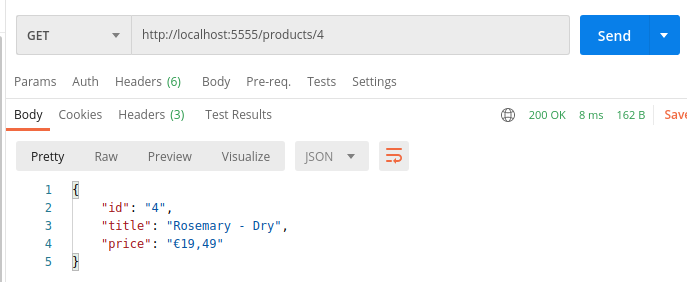
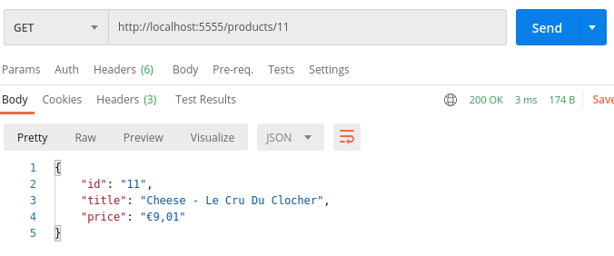

# Rust Dilinde Warp, Tokio Küfelerini Kullanarak Asenkron Web Api Geliştirmek

Rust dilinin Message Passing ve Mutex<T> konularını öğrenmeye çalışırken karşıma Warp ve Tokio küfeleri _(Crates)_ çıktı. Derken olay asenkron çalışan bir Web API geliştirme olayına döndü. Warp, Rust için geliştirilmiş bir Web Server Framework. Sonuçta bir Web API söz konusu olduğundan bu tip bir kütüphane gerekiyor. Bakalım küfeden neler çıkacak? Tokio ise Rust dilinde asenkron çalışmayı kolaylaştırmakta. Amacım bu paketlerden yararlanarak asenkron çalışan bir Web API'nin Rust dilinde geliştirme temellerini anlamak.

## Ön Hazırlıklar

Ben örneği daha önceden de olduğu gibi Heimdall _(Ubuntu 20.04)_ üstünde geliştiriyorum. Sistemde Rust yüklü.

```bash
# İlk önce web api projesini oluşturalım
cargo new musician-api

# Gerekli Paketlerin Yüklenmesi
# Tokio, Warp ve JSON serileştirme için gerekli Serde paketleri 
# Cargo.toml içerisindeki Dependencies sekmesinde yer alıyorlar
# Dolayısıyla sonrasında build işlemi yapmak lazım
cd musician-api
cargo build

# Entity olarak bir struct kullanacağız
# Models isimli küfede Product ve 
# başkalarını konuşlandırabiliriz
touch models.rs

# Veritabanı tarafı
# Aslında in-memory çalışacan bir veri modelimiz var
# Bir json kaynağındaki veriyi okuyor
touch rust_lite.rs

# Product tipi ile ilgili CRUD operasyonlarını
# product-repository isimli dosyada toplayabiliriz
touch product_repository.rs

# Web API taleplerini yöneteceğimiz bir mekanizma da gerekiyor
# Bunu router.rs içinde toplayabiliriz
touch router.rs
```

## Çalışma Zamanı

Örnek kodu çalıştırdıktan sonra Postman, curl gibi araçları kullanarak çeşitli talepler gönderebiliriz.

```bash
cargo run
```

İlk olarak tüm ürünlerin listesini çekmeyi deneyelim.

```text
Adres : http://localhost:5555/products
Metot : HTTP Get
```


ve şimdi de belli bir id değerine göre ürün çekelim. İlk çağrıda bir ürün bilgisi beklerken ikinci denemede HTTP 404 almamız gerekiyor.

```text
Adres : http://localhost:5555/products/1
Metot : Http Get

Adres : http://localhost:5555/products/123456
Metot : Http Get
```




Yeni bir ürün eklemek için HTTP Post tipinden bir çağrı yapmamız gerekir.

```text
Adres : http://localhost:5555/products
Metot : Post
Type  : JSON
Body  :
        {
            "id": "11",
            "title": "Cheese - Le Cru Du Clocher",
            "price": "€9,01"
        }
```


Pek tabii eklenen içeriği Get ile kontrol etmekte yarar var.



## Bomba Sorular

- router dosyasında setup fonksiyonu içerisinde yönlendirme bildirimleri yapılmaktadır. get_by_id(db.clone()).or(get_all(db)) şeklindeki çağrıyı get_all(db.clone()).or(get_by_id(db)) olarak kullanırsak ne gibi bir terslik olabilir, araştırınız.
- Router'daki setup fonksiyonunda ne yaparsak _borrow of moved value: "db"_ sorununun oluşmasına neden oluruz.

## Ödevler

- Router içerisinde tekrarlana kod parçalarını bulup tekilleştiriniz.
- Aynı üründen bir tane daha eklenmesini önleyecek kod geliştirmesini yapınız.
- Ürün silme ve güncelleme operasyonlarını ekleyiniz.
- Yeni bir ürün eklerken Body içerisinden gönderilecek mesaj boyutunu kontrol altına alabilir miyiz? _(1 Megabyte'lık bir JSON içeriğini eklemeye çalışmak istemeyiz öyle değil mi? :D)_