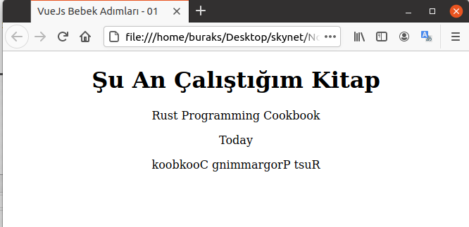
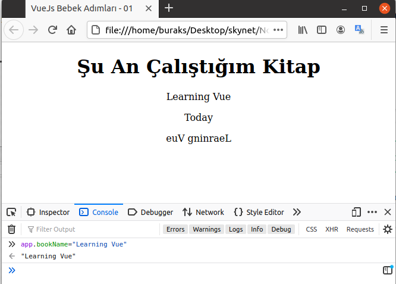
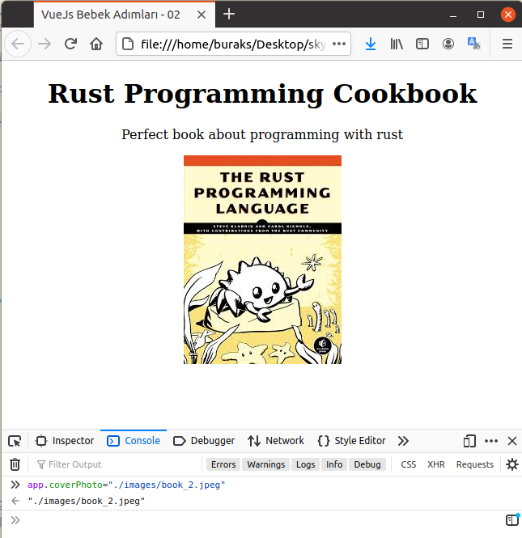

# Vue.js İçin Bebek Adımları

Frontend tarafındaki javascript çatıları _(Framework)_ söz konusu olduğunda gerçekten çok cahilim. Evet şirkette .Net Core Web API servislerini kullanan Vue.js uygulamaları söz konusu ve bunların üstünde geliştirmeler yapıyoruz ama temelleri öğrenmek adına başa dönüp bebek adımlarını atmam gerektiğini düşünüyorum. Vue'nun resmi dokümanı bu anlamda işimi görecektir.

## Hazırlıklar

Aslında çok büyük bir hazırlığa gerek. Temel konular için Vue'nun CDN kaynağından yararlanacağım tekil HTML sayfalarını kullanmayı düşünüyorum. Bebek adımları için ideal.

```bash
cd src

# İlk olarak Reactive olma halini anlamaya çalışalım
touch vue_is_reactive.html

# İkinci örnek attribute binding ile ilgili
touch vue_attribute_binding.html
```

## Çalışma Zamanı

HTML sayfalarını bir tarayıcıda açmak yeterli. Sırasıyla örneklerden elde ettiğim sonuçları da aşağıya ekran görüntüleri şeklinde alabilirim.

### vue_is_reactive Örneğine Ait Ekran Çıktıları





### vue_attribute_binding Örneğine Ait Ekran Çıktıları




## Bomba Sorular

## Ödevler

- vue_attribute_binding.html örneğinde kitap fotoğrafına bir link bağlayın _(a href)_ ve _href_ niteliğinin data nesnesindeki _url_ isimli özellikten beslenmesini sağlayın.