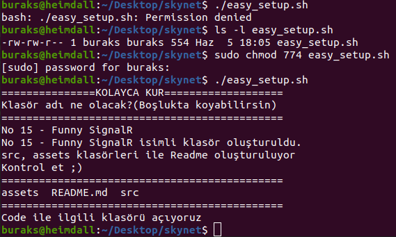

# skynet

Kodlama tarafında pas tutmamak ve iyi vakit geçirmek adına internetten bulup çalıştığım bazı konuların örnek kodlarını burada toplamaya çalışıyorum. README.md dosyaları içerisinde amacımı ve az biraz proje başlangıç adımlarını da tarifliyorum. Bir sene sonra aynı örneğe tekrar dönüp baktığımda kodlar tanıdık geliyor ve anlıyorsam çalışmam boşa gitmemiş demektir. Ve sen sevgili yazılım sevdalısı arkadaşım; giriş yazılarından faydalanıp proje açılışlarını yapabiliyorsan, kodları kendi ortamında çalıştırabiliyorsan, sağıyla soluyla oynayarak bozup düzeltiyor hayal gücünle bir şeyler ekliyorsan, senin için de işe yaramış demektir. _(Asla bir [Saturday Night Works olamayacak](https://github.com/buraksenyurt/saturday-night-works) ama olsun.)_

## Konular

~~Burada Ahch-To _(MacOS Mojave - Intel Core i5 1.4Ghz, 4 Gb 1600 Mhz DDR3)_ üzerinde geliştirmeye çalıştığım kişiel öğretilerim yer almaktadır.~~ Örnekleri bir süredir Heimdall isimli Ubuntu yüklü makinede geliştiriyorum. Ancak ara sıra şirket bilgisayarındaki Windows'u da kullandığım oluyor. Heimdall üstünde 64 bit Ubuntu yüklü. 16GB Ram kapasitesine sahip. 4 çekirdekli Intel i5 işlemcisi ve GeForce GTX 1050 ekran kartı var. Bir masaüstü oyun bilgisayarı ama onu Linux üstünde bir şeyler öğrenmek için kullanıyorum. Ahch-To kod adlı sistem ise bir MacOS. 4GB Ram'i olduğu için oldukça yavaş. Bu nedenle çok sık uğramıyorum. 

Projelerdeki zorluk seviyelerini T-Shirt Size ile belirtmeye çalıştım. Beni ne kadar zorladıklarını az çok anlayabiliyorum. Örneğin XL, o örnekte çok zorlandığım anlamına geliyor. 15nci örnekle birlikte uygulamalar içerisine bombalar _(zararlı değil eksik kodlama veya strateji)_ koymaya karar verdim. Yani örnek çalışıyor ama önemli bir eksiği var. İyice test edilince ortaya çıkan ve repoyu indiren tarafından çözülmesi beklenen._(<b>Uygulamaya Bırakılan Bomba!</b> kısımlarına dikkat)_

| No 	| Konu                                                                                                         	| İlerleme   	| Seviye 	|        Ortam        	| Bomba Soru? 	| Ödev? 	|
|----	|--------------------------------------------------------------------------------------------------------------	|------------	|:------:	|:-------------------:	|:-----------:	|:-----:	|
| 23 	|                                                                                                              	|            	|        	|                     	|             	|       	|
| 22 	| Go Dilinin Temellerini Hatırlamak                                                                            	| %40        	|    M   	|       Heimdall      	|             	|  Var  	|
| 21 	| .Net Core Üzerinde Roslyn Pratikleri Yapmak                                                                  	| %50        	|    S   	|       Heimdall      	|     Var     	|  Var  	|
| 20 	| Bir Web API Hizmetinde Request'ler ile CQ Arasında Mediator Kullanmak                                        	| Tamamlandı 	|    M   	|       Heimdall      	|     Var     	|  Var  	|
| 19 	| Daha Kolay REST Api Yazmak için Angel Paketini Kullanmak                                                     	| Tamamlandı 	|    S   	|       Heimdall      	|     Var     	|  Var  	|
| 18 	| DART Programlama Diliyle Az Biraz Uğraşmak                                                                   	| %50        	|    M   	|       Heimdall      	|     Var     	|  Var  	|
| 17 	| MQTT Protokolünün Kullanıldığı Basit Bir Publisher/Subscriber Senaryosu                                      	| Tamamlandı 	|    S   	|       Heimdall      	|     Var     	|  Var  	|
| 16 	| Bir Nginx Container'ını Load Balancer Yetkinliğiyle Kullanmak                                                	| %90        	|    L   	|       Heimdall      	|     Var     	|  Var  	|
| 15 	| Eğlenceli SignalR _(Turşunun iyisi limonla mı yapılır yoksa sirkeyle mi?)_                                   	| %80        	|    M   	|       Heimdall      	|     Var     	|       	|
| 14 	| Bir Asp.Net Core Web Api Projesinde Generic Repository Deseninin Kullanımı                                   	| %75        	|    L   	|       Heimdall      	|             	|       	|
| 13 	| Bir .Net Core Web Api Bir Nodejs Bir Python  Servisi Bir Araya Gelip docker-compose'a  Misafirliğe Gitmişler 	| Tamamlandı 	|   XL   	|       Heimdall      	|             	|       	|
| 12 	| Sequelize Kullanılan Bir NodeJs  Rest Servisi Geliştirmek                                                    	| %80        	|    S   	|       Heimdall      	|             	|       	|
| 11 	| Basit Bir .Net Core Worker Servisi  _(Linux Daemon Olarak)_                                                  	| Tamamlandı 	|    S   	|       Heimdall      	|             	|       	|
| 10 	| Python Tarafında ProtoBuf Serileştirme                                                                       	| Tamamlandı 	|    S   	|       Heimdall      	|             	|       	|
| 09 	| Distributed Cache Gerekiyorsa Elbette Redis                                                                  	| Tamamlandı 	|    S   	|       Heimdall      	|             	|       	|
| 08 	| Yine Yeni Yeniden ELK _(Bu sefer E ve K için docker-compose işin içinde)_                                    	| Tamamlandı 	|    M   	|       Heimdall      	|             	|       	|
| 07 	| Sıkça Duymaya Başladığım Deno'ya  Minik Bir Merhaba                                                          	| %80        	|    M   	|       Heimdall      	|             	|       	|
| 06 	| DT-Training _(.Net Core Eğitimi için Hazırlık)_                                                              	| %20        	|   XL   	| Heimdall Windows 10 	|     Var     	|  Var  	|
| 05 	| gRPC Tabanlı Basit Bir .Net Core Servisi  Geliştirmek ve Kullanmak                                           	| %70        	|    M   	|      Windows 10     	|             	|       	|
| 04 	| IKU Meetup _(MongoDB, Web API, Unit Test)_                                                                   	| Tamamlandı 	|    L   	|      Windows 10     	|             	|       	|
| 03 	| Razor Öğreniyorum                                                                                            	| %80        	|    M   	|      Windows 10     	|             	|       	|
| 02 	| MongoDB ile Bir GO Uygulamasını Konuşturmak                                                                  	| %85        	|    L   	|       Ahch-To       	|             	|       	|
| 01 	| Ruby Tarafından Redis _(Docker bazlı)_  Veritabanı ile Konuşmak                                              	| %95        	|    M   	|       Ahch-To       	|             	|       	|

## Hashtag

Örnekleri yaparken kendimce bir hashtag bilgilendirmesi de yapmaya çalışıyorum. Nelerden bashedilmiş sonradan hatırlayayım diye.

```text
#cSharp #dotNetCore #docker #dockerCompose #nodejs #deno #gRPC #workerService #dameon #rest #nginx #pm2
#redis #distributedCache #razor #ruby #go #express #python #flask #postrgres #sqlite #migration #morgan
#entityFramework #elasticSearch #kibana #logstash #sequilize #protobuf #unitTest #xUnit #mongoDb #upstream
#repositoryPattern #genericRepository #dependencyInjection #async #await #curl #signalR #libman #hub #loadBalancer
#dart #future #asyncFor #pub #angelFramework #MediatR #CQRS #roslyn #dotnet-script #pointer
```
## Kolay Klasör Açma

Gerek saturday-night-works olsun gerek skynet, çok sık tekrar ettiğim işlerden birisi de örneğe ait klasörler _(genelde No ile başlayan ana klasör ile src ve assets ile ilgili alt dizinler)_ ile Readme dosyasını açmak. İşi biraz kolaylaştırmak adına easy_setup.sh isimli bash script dosyasını kullanmaya karar verdim. Şimdilik iş görüyor.



## Nasıl Çalışmalı?

Buradaki öğretileri çalışmak isteyenlerin en önemli destekçileri klasörlerdeki README.md dokümanları ve kodlardaki yorum satırlarıdır. Örneklerin amacı README giriş kısımlarında kısaca ifade edilmektedir _(Samimi bir dil kullanılmaya özen gösterdim)_ Çalışırken bu kılavuzdan yararlanarak örneği/örnekleri en başından itibaren kendi sisteminizde yapmaya çalışmak çok daha yararlı olur. İster Windows ister Linux ister MacOS olsun, örneğin oluşturulması için gerekli ortamı kurgularken karşılaşacağınız sorunları çözmek bile size önemli bir tecrübe kazandıracaktır. Bazı örneklerdeki eksik kısımları tamamlamaya çalışmak da aynı şekilde.

~~## Çalışma Tekniğim~~

~~Ahch-To üzerindeki Skynet çalışmalarımda pomodoro tekniğini kullanıyorum. Buna göre genelde 22:00 sularında masa başına geçiyorum ve 4x25 dakikalık çalışma periyotları uyguluyorum. Her pomodoro arasında standart olarak 5 dakikalık dinlenme molası veriyorum. Zamanlayıcı için [tomato-timer](https://tomato-timer.com/) sitesinden yararlanıyorum.~~
